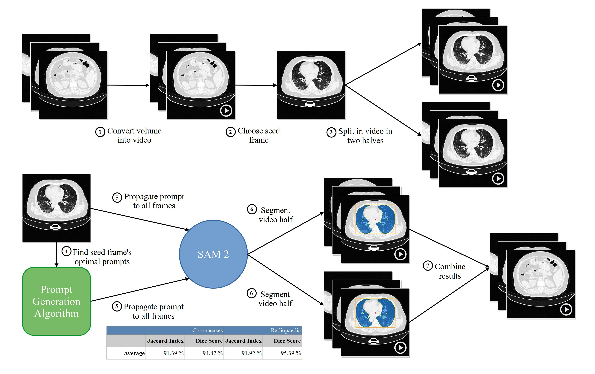

# Prompt Once, Segment Everything: Leveraging SAM 2 Potential for Infinite Medical Image Segmentation With a Single Prompt

**[i3 lab][i3lab]** by **[QSEG][qseg]**@**[UEx][uex]**

[Juan D. Gutiérrez][jdg], [Emilio Delgado][ed], [Carlos Breuer][cb], [José M. Conejero][jmc], and [Roberto Rodriguez-Echeverria][rre]

[[`Paper`][paper]][[`Project`][project]][[`Datasets`][datasets]][[`BibTex`][bibtex]]



[i3lab]: https://i3lab.unex.es/ "i3 lab"
[qseg]: https://quercusseg.unex.es/ "Quercus Software Engineering Group"
[uex]: https://www.unex.es/ "Universidad de Extremadura"

[jdg]: https://i3lab.unex.es/author/juan-d.-gutierrez/ "Juan D. Gutiérrez"
[ed]: https://i3lab.unex.es/author/emilio-delgado/ "Emilio Delgado"
[cb]: https://i3lab.unex.es/author/carlos-breuer/ "Carlos Breuer"
[jmc]: https://i3lab.unex.es/author/jose-m.-conejero/ "José M. Conejero"
[rre]: https://i3lab.unex.es/author/roberto-rodriguez-echeverria/ "Roberto Rodriguez-Echeverria"

[paper]: https://doi.org/10.1000/182 "Prompt Once, Segment Everything: Leveraging SAM 2 Potential for Infinite Medical Image Segmentation With a Single Prompt"
[project]: https://i3lab.unex.es/project/pose_code/ "Companion project"
[datasets]: #datasets "Datasets"
[bibtex]: #citing-this-work "Citing This Work"

## Table of Contents

1. [Introduction](#introduction)
2. [Requirements](#requirements)
   1. [Commands](#commands)
3. [Workspace Configuration](#workspace-configuration)
   1. [SAM](#sam)
   2. [SAM 2](#sam-2)
4. [Dataset](#datasets)
5. [Working Data](#working-data)
6. [Image Processing](#image-processing)
7. [Results Combination](#results-combination)
8. [Paper Evidences](#paper-evidences)
9. [Citing This Work](#citing-this-work)

## Introduction

Semantic segmentation of medical images holds significant potential for enhancing diagnostic and surgical procedures.
Radiology specialists can benefit from automated segmentation tools that facilitate identifying and isolating regions of interest in medical scans.
Nevertheless, to obtain precise results, sophisticated Deep Learning models tailored to this specific task must be developed and trained, a capability not universally accessible.
[SAM 2][sam_2] is a foundational model designed for image and video segmentation tasks, built on its predecessor, [SAM][sam].
This paper introduces a novel approach leveraging SAM 2's video segmentation capabilities to reduce the prompts required to segment an entire volume of medical images.\newline

The study first compares SAM and SAM 2 performance in medical image segmentation.
Evaluation metrics such as the Jaccard Index and Dice Score are used to measure precision and segmentation quality.
Then, our novel approach is introduced.
Statistical tests include comparing precision gains and computational efficiency, focusing on the trade-off between resource use and segmentation time.

The results show that SAM 2 achieves an average improvement of 1.76 % in the Jaccard Index and 1.49% in the Dice Score compared to SAM, albeit with a tenfold increase in segmentation time.
Our novel approach to segmentation reduces the number of prompts needed to segment a volume of medical images by 99.95 %.

We demonstrate that it is possible to segment all the slices of a volume and, even more, of a whole dataset, with a single prompt, achieving results comparable to those obtained by state-of-the-art models explicitly trained for this task.
Our approach simplifies the segmentation process, allowing specialists to devote more time to other tasks.
The hardware and personnel requirements to obtain these results are much lower than those needed to train a deep learning model from scratch or to modify the behavior of an existing one using model modification techniques.

[sam]: https://segment-anything.com/ "Segment Anything Model (SAM): a new AI model from Meta AI that can \"cut out\" any object, in any image, with a single click"
[sam_2]: https://ai.meta.com/sam2/ "SAM 2: Segment Anything in Images and Videos"

## Requirements

Although this project has been developed with PyCharm on Windows, taking advantage of the WSL, it should be portable to Linux and macOS. Below you can find the steps to configure a Windows environment. Change what you need for your platform.

### Commands

- `miniconda` to manage Python virtual environments.
- `wget` to download files.
- `unzip` to unpack compressed files.

## Workspace Configuration

### SAM

1. Install miniconda:

    ```shell
    $ curl https://repo.anaconda.com/miniconda/Miniconda3-latest-Linux-x86_64.sh -o Miniconda3-latest-Linux-x86_64.sh
    $ bash Miniconda3-latest-Linux-x86_64.sh
    ```

2. Create a new environment:

    ```shell
    $ conda create --name sam2 python=3.10
    ```

    In this command, **sam2** stands for **Segment Anything Model version 2**.

3. Deactivate any previous environment and activate the new one:

    ```shell
    $ conda deactivate
    $ conda activate sam
    ```

4. Install PyTorch, Torchvision, and Torchaudio:

    ```shell
    $ pip install torch torchvision torchaudio --index-url https://download.pytorch.org/whl/cu118
    ```

5. Install SAM:

    ```shell
    $ pip install git+https://github.com/facebookresearch/segment-anything.git
    ```

6. Install this project's requirements:

    ```shell
    $ pip install -r requirements.txt
    ```

7. Execute the shell script **scripts/download_model_checkpoints.sh** to get SAM's model checkpoints:

    ```shell
    $ scripts/download_checkpoints.sh
    ```

8. Configure PyCharm. If you are working on Windows, make sure you use WSL and that your interpreter is also based on WSL.

    > **Note:** Be careful with the EOL configuration in you IDE. Always choose LF instead of CRLF to avoid compatibility issues, as this is a multiplatform project.

> **Note:** If you no longer need the Conda environment, just deactivate it with `conda deactivate` and delete it with `conda remove -n sam --all`.

### SAM 2

> **Note**: Although PyTorch includes its own CUDA version, it is not available to the rest of the system. That is why it is necessary to install CUDA independently.

1. [Install Miniconda][miniconda_installation]:

    ```shell
    $ mkdir -p ~/miniconda3
    $ wget https://repo.anaconda.com/miniconda/Miniconda3-latest-Linux-x86_64.sh -O ~/miniconda3/miniconda.sh
    $ bash ~/miniconda3/miniconda.sh -b -u -p ~/miniconda3
    $ rm -rf ~/miniconda3/miniconda.sh
    $ ~/miniconda3/bin/conda init bash
    $ ~/miniconda3/bin/conda init zsh
    ```

    [miniconda_installation]: https://docs.anaconda.com/miniconda/#quick-command-line-install "Quick command line install"

2. Create and activate a new environment:

    ```shell
    $ conda create --name sam2 python=3.12.4
    $ conda activate sam2
    ```

    Python 3.12.4 has been chosen because is the default version in Ubuntu 24.04 (Noble Numbat).

3. [Install CUDA][cuda_installation]:

    ```shell
    $ conda install nvidia/label/cuda-12.1.0::cuda
    ```

    [cuda_installation]: https://anaconda.org/nvidia/cuda "CUDA Installation"

4. [Install PyTorch, Torchvision, and Torchaudio][pytorch_installation]:

    ```shell
    $ pip install torch==2.3.1 torchvision==0.18.1 torchaudio==2.3.1 --index-url https://download.pytorch.org/whl/cu121
    ```

    [pytorch_installation]: https://pytorch.org/get-started/previous-versions/#linux-and-windows-1 "Installing previous versions of PyTorch"

5. [Install SAM 2][sam2_installation]:

    ```shell
    $ git clone git@github.com:facebookresearch/segment-anything-2.git
    $ cd segment-anything-2
    $ pip install .
    $ pip install ".[demo]"
    ```

    > **Note**: In the previous steps, I understand that the second **pip** does the same as the first, but installs more stuff. I'm not sure, so I leave them both.

    During the video prediction process, a warning appears:

    > Skipping the post-processing step due to the error above. You can still use SAM 2 and it's OK to ignore the error above, although some post-processing functionality may be limited.

    They lead you to [a web page][warning_web_page] where they explain how to solve the problem. In summary, you have to install SAM 2 with the following command:

    ```shell
    $ SAM2_BUILD_ALLOW_ERRORS=0 pip install ".[demo]"
    ```

    However, this command does not work and the error persists.

    [sam2_installation]: https://github.com/facebookresearch/segment-anything-2/?tab=readme-ov-file#installation "SAM 2 Installation"
    [warning_web_page]: https://github.com/facebookresearch/segment-anything-2/blob/main/INSTALL.md#building-the-sam-2-cuda-extension "Building the SAM 2 CUDA extension"

6. Copy SAM 2 configuration profiles to the root folder of this project:

    ```shell
    $ cp -R sam2_configs /path/to/this/project
    ```

## Datasets

This project works with two datasets: "COVID-19 CT Lung and Infection Segmentation Dataset" and "Montgomery County X-ray Set".

### COVID-19 CT Lung and Infection Segmentation Dataset

- **Location:** [Zenodo][covid_dataset_location].
- **Description:** 3520 slices from 20 patients.

Execute the script **scripts/download_covid_dataset.sh** from the root folder of this project to download the dataset:

```shell
$ scripts/download_covid_dataset.sh
```

[covid_dataset_location]: https://zenodo.org/record/3757476 "COVID-19 CT Lung and Infection Segmentation Dataset"

### Montgomery County X-ray Set

- **Location:** [Open-i][montgomery_dataset_location]. Look under "I have heard about the Tuberculosis collection. Where can I get those images ?", follow the link for "Montgomery County X-ray Set".
- **Description:** 138 posterior-anterior x-rays, with their corresponding lung masks.

Execute the script **scripts/download_montgomery_dataset.sh** from the root folder of this project to download the dataset:

```shell
$ scripts/download_montgomery_dataset.sh
```

[montgomery_dataset_location]: https://openi.nlm.nih.gov/faq "What is Open-i ?"

## Working Data

> **Important:** The whole project uses the coordinates convention rows, columns (y, x) instead of x, y. To avoid any misunderstandings, the naming reflects this fact.

The project includes various run/debug configurations. In order to create the working data from the dataset, you need to execute **nifti_to_numpy** with the required arguments. As a reference, this is the command you have to execute from the command line to create the NumPy files from the NIfTI ones, for one image:

```shell
$ conda run -n sam --no-capture-output python nifti_to_numpy.py --input_file_path datasets/covid/COVID-19-CT-Seg_20cases/coronacases_001.nii.gz --output_file_path working_data/image_coronacases_001.npy --swap_axes

$ conda run -n sam --no-capture-output python nifti_to_numpy.py --input_file_path datasets/covid/Lung_Mask/coronacases_001.nii.gz --output_file_path working_data/masks_coronacases_001.npy --swap_axes
```

The argument `--swap_axes` is included because of the coordinates convention adopted in this project.

You can also run the script **nifti_to_numpy.sh** from the root of this project to create the NumPy files from all the NIfTI ones:

```shell
$ scripts/nifti_to_numpy.sh
```

## Image Processing

You can process just a slide from a CT image:

```shell
$ conda run -n sam --no-capture-output python process_image.py --image_file_path working_data/covid/image_coronacases_001.npy --masks_file_path working_data/covid/masks_coronacases_001.npy --slice 122 --apply_windowing --use_bounding_box --debug
```

You can also process the whole CT image:

```shell
$ conda run -n sam --no-capture-output python process_image.py --image_file_path working_data/covid/image_coronacases_001.npy --masks_file_path working_data/covid/masks_coronacases_001.npy --apply_windowing --use_bounding_box --debug
```

You can even process a list of images using the script **process_covid_images.sh**. Use the list inside it to select the images to process. When it finishes, the results will be stored inside the folder **results** in the **working_data/covid** folder, in a series of folders named after each image processed. A summary of the results will be stored in the folder **results**. If `--debug` is included, the folder **debug** inside **working_data/covid** will contain additional information regarding the segmentation process. The argument `--apply_windowing` enhances the contrast for the lung area, if it wasn't previously applied. Include the argument `--use_bounding_box` if you want to pass it to SAM as an additional prompt.

## Results Combination

When processing the whole dataset using the script **process_covid_images.sh**, the results obtained for each CT scan volume would be in its corresponding folder. Instead of leaving the user with the burden of composing aggregate results, the script **join_results.py** performs this task. Just pass the location of the results folder via the argument `--results_folder_path`. The script will create three files:

- **joint_raw_data.csv**: contains all the raw data, concatenated. The name of the image is included as a new column.
- **joint_results.csv**: combines the results of each image in a single file.
- **results.csv**: statistical values for each metric (Jaccard index and Dice score) calculated from **joint_raw_data.csv**.

Each file includes a suffix with a timestamp.

## Paper Evidences

The folder **paper** contains all you need to recreate the evidences included in the paper.

The folder **comparison** contains all you need to recreate the comparison included in the paper.

## Citing This Work

If you use this work in your research, please cite us with the following BibTeX entry:

```
@ARTICLE{gutierrez25,
  author={Gutiérrez, Juan D. and Delgado, Emilio and Breuer, Carlos, Conejero, José M., and Rodriguez-Echeverria, Roberto},
  journal={Algorithms},
  title={Prompt Once, Segment Everything: Leveraging SAM 2 Potential for Infinite Medical Image Segmentation With a Single Prompt},
  year={2025},
  volume={},
  number={},
  pages={1-1},
  doi={10.1000/182}}

```
